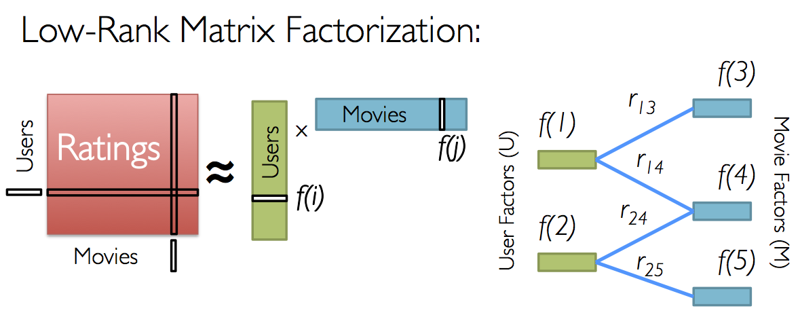

---
output:
  pdf_document: default
  html_document: default
---

The previous models were based on the expectation that our intuitions, confirmed by visual inspection of the dataset, would lead to better performing models. This section shows this is incorrect. We here present a more _"brute-force"_ model: a *low-rank matrix factorisation* with is approximated by a *stochastic gradient descent*.

This model proves to be very efficient:

+ Before any training, the validation set RMSE is 0.88516 thanks to a non-naive (i.e. not random) initialisation;

+ After very little training, using the initial 3 features (explained below), the RMSE became 0.8304 which improves on the targetted RMSE.

+ A few hours of training brings the RMSE down to *0.7996* with 11 features ^[This is a white lie since many more hours went into exploring the various parameters.]. Visually, the RMSE improvements suggest that additional features may help.


## Latent factor model

The approach we follow ia a Latent Factor Model. This section partly draws on part 9 of the Stanford Machine Learning course taught by Andrew Ng (which we previously completed), and a blog post by Sonya Sawtelle ^[See https://sdsawtelle.github.io/blog/output/week9-recommender-andrew-ng-machine-learning-with-python.html].

In essence, this is a dimension reduction model. But two differences reduce the computational workload:

+ Users and movies are coalesced into groups of similar users and similar movies. This is purely based on the triplets user / movie / rescaled rating. Information about dates, genres is ignored.

+ The model is trained by Stochastic Gradient Descent (SGD). Gradient descent methods are a class of optimisation algorithms that minimise a cost function following downward gradients. SGD is a stochastic version of it where random subsets of the training set are used to converge on very large datasets.


## Formal description

### Low-rank factorisation

#### Singular Value Decomposition

As noted in the course material (section 34.1.1), singular value decomposition (SVD) is widely used in machine learning. Wikipedia provides a general description which includes a geometric intuition ^[https://en.wikipedia.org/wiki/Singular_value_decomposition]. 

However, this approach is not feasible: the dimensions are too large, the dataset is extremely sparse.

#### Low-rank matrix factorisation (LRMF)

At a high level, the purpose of this assignment is to estimate a matrix $R$ of $N_{users}$ rows by $N_{movies}$ columns, where each value contains the rating given by a user to a movie. This is to be estimated from a sample of values from the training set. 

The intuitive and geometric intuition of LRMF is as follows:

+ Work in a low dimensional space ($k$ dimensions).

+ In that space, give each user $u$ and movie $m$ coordinates in that space ($u = (u_1, ..., u_k)$ and $m = (m_1, ..., m_k)$).

+ Note that the cross-product of two points in that space will be zero or close to zero if the points are in perpendicular directions. Conversely, points in a close zone in that space will have a cross-product away from zero. In that sense, movies and users can be grouped together in that space: similar movies would be in the same zone of space, different movies would be in perpendicular positions. Because movies ans users both have coordinates in that space, then can all be mixed and grouped: one can measure the similarities between movies, user or between movie and user. The dimensions are commonly called _features_.

In practice, LRMF is represented by two matrices each with $k$ columns: $P$ of $N_{users}$ rows, and $Q$  of $N_{users}$ rows. The $k$ columns give the $k$ coordinates of each user and movie in the feature space. Choosing a user and a movie, the cross-product of the corresponding rows in $P$ and $Q$ gives $u \times m = \sum_{i = 1}^{k}{u_i m_i}$ and should produce a rating.   

The purpose of the algorithm is then to estimate $P$ and $Q$ so that the cross-products match that of the training sets. That is, n matrix notation, $R$ is estimated by $P Q^{\top}$.


^[source: https://towardsdatascience.com/large-scale-jobs-recommendation-engine-using-implicit-data-in-pyspark-ccf8df5d910e]


It is important to note that the only information used is the rating. Knowledge about the genres of the movies, timestamp of a rating, year a movie premiered is ignored. 


### Gradient Descent

SVD is not useful in our context because (1) the size of the matrices involved is too large, and (2) more importantly requires a fully populated matrix (filling out missing values is a difficult issue). 

Instead, we will iteratively estimate the $P$ and $Q$ matrices' coefficients by gradient descent. The cost function used represents prediction error with an additional regularisation cost over those coefficients. 

#### Cost function

Let's use the following terms:

+ $\Omega$ is the set of all $(user, movie)$ pairs in the training set;
+ For each $(u,m)$ in $\Omega$, $r_{u,m}$ is the rating in the training set.
+ $P$ is written as $p_{i,k}$, $Q$ is written as $q_{j,k}$ with $i \in [1,...,N_{users}]$, $j \in [1,...,N_{movies}]$ and $k \in [1,...,N_{features}]$.
+ $\lambda$ is the regularisation parameter.

Our regularised cost function is written:


$$ 
J_{P,Q} = \sum_{(i, j) \in \Omega} {\left (  r_{i,j} - \sum_{k=1}^{N_{features}}{p_{i,k} q_{j,k}} \right )^2} + \frac{\lambda}{2} \left (  \sum_{i,k}{p_{i,k}^2} +  \sum_{j,k}{q_{j,k}^2} \right ) 
$$

The gradient descent algorithm seeks to minimise the $J_{P,Q}$ cost function by step-wise update of each model parameter $x$ as follows:

$$
x_{t+1} \leftarrow x_{t} - \alpha \frac{\partial J_{P,Q}}{\partial x} 
$$

The parameters are the matrix coefficients $p_{i,k}$ $q_{j,k}$. $\alpha$ is the learning parameter that needs to be adjusted.


#### Cost function partial derivatives

The partial derivatives of the cost function is:


$$
\frac{\partial J_{P,Q}}{\partial x} = \frac{\partial}{\partial x} \left ( \sum_{(i, j) \in \Omega} {\left ( r_{i,j} - \sum_{k=1}^{N_{features}}{p_{i,k} q_{j,k}} \right )^2} + \frac{\lambda}{2} \left ( \sum_{i,k}{p_{i,k}^2} + \sum_{j,k}{q_{j,k}^2} \right ) \right )
$$

$$
\frac{\partial J_{P,Q}}{\partial x} = \sum_{(i, j) \in \Omega} { 2 \frac{\partial r_{i,j} - \sum_{k=1}^{N_{features}} {p_{i,k} q_{j,k}}} {\partial x} \left (  r_{i,j} - \sum_{k=1}^{N_{features}}{p_{i,k} q_{j,k}} \right )  } + \frac{\lambda}{2} \left ( \sum_{i,k}{2 \frac{\partial p_{i,k}}{\partial x} p_{i,k}} + \sum_{j,k}{2 \frac{\partial p_{i,k}}{\partial x} q_{j,k}} \right ) 
$$

We note that $r_{i,j}$ are constants

$$
\frac{\partial J_{P,Q}}{\partial x} = 2 \sum_{(i, j) \in \Omega} \sum_{k=1}^{N_{features}}  \left (  {     \frac{\partial - {p_{i,k} q_{j,k}}}{\partial x} \left (  r_{i,j} - \sum_{k=1}^{N_{features}}{p_{i,k} q_{j,k}} \right ) }  \right ) + \lambda \left (    \sum_{i,k}{\frac{\partial p_{i,k}}{\partial x} p_{i,k}} + \sum_{j,k}{\frac{\partial p_{i,k}}{\partial x} q_{j,k}} \right ) 
$$


If $x$ is a coefficient of $P$ (resp. $Q$), say $p_{a,b}$ (resp. $q_{a,b}$), all partial derivatives will be nil unless for $(i,j) = (a,b)$. 

Therefore:


$$ 
\frac{\partial J_{P,Q}}{\partial p_{a,b}} = -2 \sum_{(i, j) \in \Omega} { q_{j,b} \left (  r_{i,j} - \sum_{k=1}^{N_{features}}{p_{i,k} q_{j,k}} \right )} + \lambda p_{a,b} 
$$

and,

$$
\frac{\partial J_{P,Q}}{\partial q_{a,b}} = -2 \sum_{(i, j) \in \Omega} { p_{i,b} \left (  r_{i,j} - \sum_{k=1}^{N_{features}}{p_{i,k} q_{j,k}} \right ) } + \lambda q_{a,b} 
$$

Since $\epsilon{i, j} = r_{i,j} - \sum_{k=1}^{N_{features}}{p_{i,k} q_{j,k}}$ is the rating prediction error, this becomes:


$$ 
\frac{\partial J_{P,Q}}{\partial p_{a,b}} = -2 \sum_{(i, j) \in \Omega} { q_{j,b} \epsilon_{i,j}} + \lambda p_{a,b} 
$$
and,

$$
\frac{\partial J_{P,Q}}{\partial q_{a,b}} = -2 \sum_{(i, j) \in \Omega} { p_{i,b} \epsilon_{i,j} } + \lambda q_{a,b} 
$$


### Stochastic Gradient Descent (SGD)

The size of the datasets is prohibitive to do those calculations across the entire training set. 

Instead, we will repeatedly update the model parameters on small random samples of the training set. 

Chapter 14 of [@shalev2014understanding] gives an extensive introduction to various SGD algorithms.

We implemented a simple version of the algorithm and present the code in more detail.


## SGD Code walk

The algorithm is implemented from scratch and relies on nothing but the `Tidyverse` libraries.

```{r s_function_definitions,eval=FALSE,echo=TRUE}
library(tidyverse)
```

The quality of the training and predictions is measured by the _root mean squared error_ (RMSE), for which we define a few helper functions (the global variables are defined later):


```{r eval=FALSE,echo=TRUE}
rmse_training <- function(){
  prediction_Z <- rowSums(Matrices$P[tri_train$userN,] * 
                            Matrices$Q[tri_train$movieN,])
  prediction <- prediction_Z * r_sd + r_m
  sqrt( sum((tri_train$rating - prediction)^2 / nSamples) )
}

rmse_validation <- function(){
  prediction_Z <- rowSums(Matrices$P[tri_test$userN,] * 
                            Matrices$Q[tri_test$movieN,])
  prediction <- prediction_Z * r_sd + r_m
  sqrt( sum((tri_test$rating - prediction)^2) / nTest )
  }

sum_square <- function(v){
  return (sqrt(sum(v^2) / nrow(v)))
}
```


The key function updates the model coefficients. Its inputs are:

+ a list that contains the $P$ an $Q$ matrices, the training RMSE of those matrices, and a logical value indicating whether this RMSE is worse than what it was before the update (i.e. did the update diverge).

+ a `batch_size` that defines the number of samples to be drawn from the training set. A normal gradient descent would use the full training set; by default we only use 10,000 samples out of 10 million (one tenth of a percent). 

+ The cost regularisation `lambda` and gradient descent learning parameter `alpha`.

+ A number of `times` to run the descent before recalculating the RMSE and exiting the function (calculating the RMSE is computationally expensive).


The training set used is less rich than the original set. As discussed, it only uses the rating (more exactly on the z_score of the rating). Genres, timestamps,... are discarded.


```{r s_stochastic_gardient,eval=FALSE,echo=TRUE}
# Iterate gradient descent
stochastic_grad_descent <- function(model, times = 1,
                                    batch_size = 10000, lambda = 0.1, alpha = 0.01,
                                    verbose = TRUE) {

  # Run the descent `times` times.
  for(i in 1:times) {
    
    # Extract a sample of size `batch_size` from the training set.
    spl <- sample(1:nSamples, size = batch_size, replace = FALSE)
    spl_training_values <- tri_train[spl,]


    # Take a subset of `P` and `Q` matching the users and 
    # movies in the training sample.
    spl_P <- model$P[spl_training_values$userN,]
    spl_Q <- model$Q[spl_training_values$movieN,]

    # rowSums returns the cross-product for a given user and movie.
    # err is the term inside brackets in the partial derivatives 
    # calculation above.
    err <- spl_training_values$rating_z - rowSums(spl_P * spl_Q)

    # Partial derivatives wrt p and q
    delta_P <- -err * spl_Q + lambda * spl_P
    delta_Q <- -err * spl_P + lambda * spl_Q

    model$P[spl_training_values$userN,]  <- spl_P - alpha * delta_P
    model$Q[spl_training_values$movieN,] <- spl_Q - alpha * delta_Q

  }

  # RMSE against the training set
  error <- sqrt(sum(
    (tri_train$rating_z - rowSums(model$P[tri_train$userN,] * 
                                    model$Q[tri_train$movieN,]))^2)
    / nSamples )

  # Compares to RMSE before update
  model$WORSE_RMSE <- (model$RMSE < error)
  model$RMSE <- error
  
  # Print some information to keep track of success
  if (verbose) {
    cat("  # features=", ncol(model$P),
        "  J=",  nSamples * error ^2 + 
          lambda/2 * (sum(model$P^2) + sum(model$Q^2)),
        "  Z-scores RMSE=", model$RMSE,
        "\n")
    flush.console()
  }

    return(model)
}
```


Now that the functions are defined, we prepare the data sets.

+ First load the original data if not already available.

```{r s_load_datasets,eval=FALSE,echo=TRUE}
# Load the datasets which were saved on disk after using the course source code.
if(!exists("edx"))        edx <- readRDS("datasets/edx.rds")
if(!exists("validation")) validation <- readRDS("datasets/validation.rds")
```

+ Calculate the z-score of all ratings.

```{r s_create_reduced_datasets,eval=FALSE,echo=TRUE}
# Creates a movie index from 1 to nMovies
r_m <- mean(edx$rating)
r_sd <- sd(edx$rating)

training_set <- edx %>%
  select(userId, movieId, rating) %>%
  mutate(rating_z = (rating - r_m) / r_sd)

test_set <- validation %>%
  select(userId, movieId, rating) %>%
  mutate(rating_z = (rating - r_m) / r_sd)
```

+ We do not know if there are any gaps in the userId's and movieId's in the datasets. They cannot be used as the row numbers of the $P$ and $Q$ matrices. Therefore we count how many distinct users and movies there are and create an index to link a movieId (resp. userId) to its $Q$ (resp. $P$) -matrix row number.

```{r eval=FALSE,echo=TRUE}
movieIndex <-
  training_set %>%
  distinct(movieId) %>%
  arrange(movieId) %>%
  mutate(movieN = row_number())

userIndex <-
  training_set %>%
  distinct(userId) %>%
  arrange(userId) %>%
  mutate(userN = row_number())
```

+ For each movie and user, we calculate its mean rating z-score.

```{r eval=FALSE,echo=TRUE}
movieMean <-
  training_set %>%
  group_by(movieId) %>%
  summarise(m = mean(rating_z))

userMean <-
  training_set %>%
  group_by(userId) %>%
  summarise(m = mean(rating_z))
```

+ We can now create the training and validation sets contining the movie index (instead of the movieId), user index and ratings (original and z-score).

```{r eval=FALSE,echo=TRUE}
# Training triplets with z_score
tri_train <- training_set %>%
  left_join(userIndex, by = "userId") %>%
  left_join(movieIndex, by = "movieId") %>%
  select(-userId, -movieId)

tri_test <- test_set %>%
  select(userId, movieId, rating) %>%
  left_join(userIndex, by = "userId") %>%
  left_join(movieIndex, by = "movieId") %>%
  select(-userId, -movieId) %>%
  mutate(rating_z = (rating - r_m)/r_sd,
         error = 0)
```


```{r eval=FALSE,echo=TRUE}
nSamples <- nrow(tri_train)
nTest <- nrow(tri_test)

nUsers <- tri_train %>% select(userN) %>%  n_distinct()
nMovies <- tri_train %>% select(movieN) %>%  n_distinct()
```

+ The $P$ and $Q$ matrices are defined with 3 latent factors to start with.

```{r s_create_feature_matrices,eval=FALSE,echo=TRUE}
# number of initial latent factors
nLF <- 3

LF_Model <- list( P = matrix(0, nrow = nUsers, ncol = nLF),
                  Q = matrix(0, nrow = nMovies, ncol = nLF),
                  RMSE = 1000.0,
                  WORSE_RMSE = FALSE)

```


+ To speed up the training, the matrices are initialised so that the cross product is the sum of the movie average z-rating ($m_{movieN}$) and user z-rating ($u_{userN}$). 

$$ 
P \times Q^{\top} = 
\begin{bmatrix}
1      & u_{1}      & 0     \\
1      & u_{2}     & 0      \\
\vdots & \vdots    & \vdots \\
1      & u_{i}     & 0      \\
\vdots & \vdots    & \vdots \\
1      & u_{nUser} & 0      \\
\end{bmatrix}
\times 
\begin{bmatrix}
m_{1} & m_{2} & \cdots & m_{j} & \cdots & m_{nMovies} \\
1     & 1     & \cdots & 1     & \cdots & 1           \\
0     & 0     & \cdots & 0     & \cdots & 0           \\
\end{bmatrix}
= 
\begin{bmatrix}
       & \vdots        &        \\
\cdots & u_{i} + m_{j} & \cdots \\
       & \vdots        &        \\ 
\end{bmatrix}
$$


```{r eval=FALSE,echo=TRUE}
# Features matrices are initialised with:
# Users: 1st column is 1, 2nd is the mean rating (centered), rest is noise
# Movies: 1st column is the mean rating (centered), 2nd is 1, rest is noise
#
# That way, the matrix multiplication will start by giving reasonable value

LF_Model$P[,1] <- matrix(1, nrow = nUsers, ncol = 1)
LF_Model$P[,2] <- as.matrix(userIndex %>% 
                              left_join(userMean, by ="userId") %>% select(m))

LF_Model$Q[,1] <- as.matrix(movieIndex %>% 
                              left_join(movieMean, by ="movieId") %>% select(m))
LF_Model$Q[,2] <- matrix(1, nrow = nMovies, ncol = 1)
```

+ Random noise is added to all model parameters, otherwise the gradient descent has nowhere to start (zeros wipe everything in the matrix multiplications).

```{r eval=FALSE,echo=TRUE}
# Add random noise
set.seed(42, sample.kind = "Rounding")
LF_Model$P <- LF_Model$P + matrix(rnorm(nUsers * nLF,
                                              mean = 0,
                                              sd = 0.01),
                                        nrow = nUsers,
                                        ncol = nLF)

LF_Model$Q <- LF_Model$Q + matrix(rnorm(nMovies * nLF,
                                              mean = 0,
                                              sd = 0.01),
                                        nrow = nMovies,
                                        ncol = nLF)
```

+ We also have a list that keeps track of all the training steps and values.

```{r eval=FALSE,echo=TRUE}
rm(list_results)
list_results <- tibble("alpha" = numeric(), 
                       "lambda" = numeric(),
                       "nFeatures" = numeric(),
                       "rmse_training_z_score" = numeric(),
                       "rmse_training" = numeric(), 
                       "rmse_validation" = numeric())
```


The main training loop runs as follows:

+ We start with 3 features. 

+ The model is updated in batches of 100 updates. This is done up to 250 times. At each time, if the model starts diverging, the learning parameter ($\alpha$) is reduced. 

+ Once the 250 times have passed, or if $\alpha$ has become incredibly small, or if the RMSE doesn't really improve anymoe (by less than 1 millionth), we add another features and start again. 

```{r s_training_loop,eval=FALSE,echo=TRUE}
initial_alpha <- 0.1
for(n in 1:100){

  # Current number of features
  number_features <- ncol(LF_Model$P)

  # lambda = 0.01 for 25 features, i.e. for about 2,000,000 parameters.
  # We keep lambda proportional to the number of features
  lambda <- 0.1 * (nUsers + nMovies) * number_features / 2000000

  alpha <- initial_alpha

  cat("CURRENT FEATURES: ", number_features, 
      "---- Pre-training validation RMSE = ", rmse_validation(), "\n")

  list_results <- list_results %>% add_row(alpha = alpha, 
                                           lambda = lambda, 
                                           nFeatures = number_features,
                                           rmse_training_z_score = LF_Model$RMSE,
                                           rmse_training = rmse_training(), 
                                           rmse_validation = rmse_validation())
      
  for (i in 1:250){
    pre_RMSE <- LF_Model$RMSE
    LF_Model <- stochastic_grad_descent(model = LF_Model,
                                        times = 100,
                                        batch_size = 1000 * number_features,
                                        alpha = alpha,
                                        lambda = lambda)
    
    list_results <- list_results %>% add_row(alpha = alpha, 
                                             lambda = lambda, 
                                             nFeatures = number_features,
                                             rmse_training_z_score = LF_Model$RMSE,
                                             rmse_training = rmse_training(), 
                                             rmse_validation = rmse_validation())
    
    if (LF_Model$WORSE_RMSE) {
      alpha <- alpha / 2
      cat("Decreasing gradient parameter to: ", alpha, "\n")
    }

    if (initial_alpha / alpha > 1000 | 
        abs( (LF_Model$RMSE - pre_RMSE) / pre_RMSE) < 1e-6) {
      break()
      }
  }


  # RMSE against validation set:
  rmse_validation_post <- rmse_validation()
  cat("CURRENT FEATURES: ", number_features, 
      "---- POST-training validation RMSE = ", rmse_validation_post, "\n")

  # if (number_features == 12){
  #   break()
  # }


  # Add k features
  k_features <- 1
  LF_Model$P <- cbind(LF_Model$P,
                         matrix(rnorm(nrow(LF_Model$P) * k_features,
                                      mean = 0,
                                      sd = sd(LF_Model$P)/100),
                                nrow = nrow(LF_Model$P),
                                ncol = k_features))

  LF_Model$Q <- cbind(LF_Model$Q,
                      matrix(rnorm(nrow(LF_Model$Q) * k_features,
                                   mean = 0,
                                   sd = sd(LF_Model$Q)/100),
                             nrow = nrow(LF_Model$Q),
                             ncol = k_features))

}

```

The following table shows the RMSE on the validation set that is obtained for a given number of features.

```{r}
if(!exists("list_results")) list_results <- readRDS("datasets/LRMF_results.rds")
options(digits = 6)
list_results %>% group_by(nFeatures) %>% summarise(best_RMSE = min(rmse_validation))
options(digits = 6)
```

This plot shows the progress of the RMSE on the validation set. It shows an overall improvement with the number of features, with little worsening spikes each time a feature seeded with random values is added.

```{r fig.cap="Plot of the RmSE on the validation test"}
list_results %>% ggplot(aes(n, rmse_validation, color = nFeatures)) + geom_point()
```

We also developed a re-implementation in Julia (availabe on Gihub) that we used to cross-check the R implementation. It gave similar results (in much less time):


